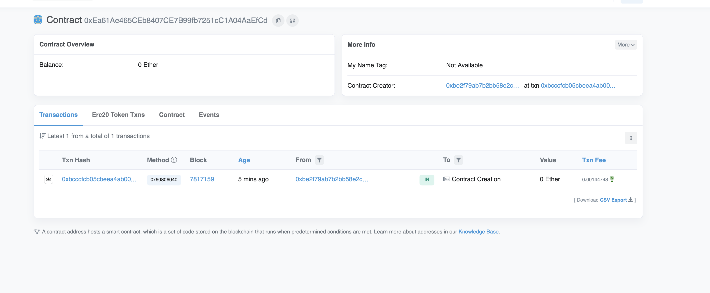

# Smart Contracts With Truffle

## Initial step

- Create a repository and clone it into a local folder
- Check to ensure that you have node installed
  - node can be installed from the [link](https://nodejs.org/en/)
- Download ganache here from [here](https://trufflesuite.com/ganache/)

## Truffle Initialization

- Open the command line and run the command below to install truffle
  > `npm i truffle -g`
- The above command also populates the repository with the required folders and truffle config files
- Next step is to use the command `truffle init` to start integrating the smart contracts within truffle
  - This above step allows us to run `truffle compile`, `truffle migrate` and `truffle test` to compile your contracts, deploy those contracts to the network, and run their associated unit tests.

## Smart Contracts

Next step is to create smart contracts, compile and deploy them

- First Step is to create smart contracts using solidity within the `contracts/` folder
- Within the `migration/` folder, we create all our deployment scripts. These scripts allow us to initialize the smart contracts and specify the development process/ step up
- Additionally, created after installing truffle is the `test/` folder, which allows us to write unit test scripts using chai and mocha to test our code

### Compile smart contracts

- `truffle compile` to compile all smart contract source files

### Deploying smart contracts

> `truffle migrate`

- run migrations to deploy contracts within the local chain

### Truffle Dev Env

> `truffle develop`

- To open a console with a development blockchain
- Truffle develops and brings out the actual web chain with a local Ethereum node, which will give local addresses and some private keys to use only for development (no real funds present)
- Using truffle migrate again will connect you to the local instance and then deploy the contracts to it. Later you can see details about each contract specifying the transaction hash etc.
- The next steps are interacting and testing our contracts.
- For this we need to define a contract instance which is a, `javascript` object that defines our contract.
- Create javascript test script to test if constructor sets our message. The code is within the `test/helloworld_test.js`

#### Migration

- first we create a constructor with some arguments.
- we change _pure function_ to _view function_ since we are actually interacting with state variables
- We create another function that will show interaction with string `memory_message` to set the actual input variables that we have and this will set `message=_message`
- Compile the files and then use `truffle develop` to get the local node started.
- Next; the migration file of hello world requires a constructor argument for deployment. -`instance.hello()` and `instance.message()` functions should return the same initial string
- With this the test is complete and we are moving on
- When we call `instance.setMessage()`, it will mean that you are calling a function that changes the smart contract’s state. When you add an argument, it gives back the receipt of the transaction, which means that the transaction has been processed.
  -If you migrate again after adding the required condition, it will show that the network is up to date. It means that you cannot overwrite an existing contract. Truffle does not let u do this. In that case, you need to have a proxy contract, or else you need to redeploy a completely new contract.
- When we are on a local chain, we can just deploy a new one using the `migrate — reset` option. That will replace the contracts and redeploy them to new addresses
- `web3.utils.toWei` converts any value into Wei. So we will use it with the setMessage function. `Helloworldpermanent` function should contain the same message as hello world after we do the command `migrate —reset `
  -There are totally three deployments, including migrations, hello world, and hello world permanent after doing the migrate reset option.
- Finally ; `instance.message()` gives the message hello world constructor.

#### Testing

- For testing, we should have an anonymous or error function so you can send in some different arguments.
  Here, we are testing, for example, ownership.
- You can have multiple similar statements full of tests for each file, and for each contract statement, it will redeploy your contract so that it is in a new clean state.
- In the given program, we are testing that after deployment, if the message in the contract is actually “hello world constructor”.
- If our affirmation fails, it means that something is wrong with our constructor because we have actually set it to HelloWorld constructor, and that’s how the unit test works.
- When we will test it using the `truffle test` cmd, it will compile and deploy contracts according to the migration files.
- Use `truffle test` and you will get the following output if the affirmation is correct: **`Compiling your contracts...`**

The output should look as follows :

```
Everything is up to date, there is nothing to compile.

Contract: HelloWorld
✔ constructor should set the message correctly
1 passing (36ms)
```

We will now give a wrong test instance to see what output the truffle cmd gives. The following is the output:

```
0 passing (43ms)
1 failing

1) Contract: HelloWorld
    constructor should set the message correctly:

    AssertionError: expected 'CUSTOM MESSAGE' to equal 'Hello World constructor'
    + expected - actual

     -CUSTOM MESSAGE
     +Hello World constructor
```

We can also create a test condition to specify the account number of the owner, because in our contract we might have functions that can only be executed by the owner and therefore, it is important to have the correct owner set. For that, we need to set the address owner to the public to make-instance. Then, the given test instances will pass both tests. This owner function test is:

```
it("owner should be accounts [0]", async () => {
    let instance = await HelloWorld.deployed();
    let owner = await instance.owner();
    assert.equal(owner, accounts[0]);
  });
```

#### Deploying smart contracts to a real blockchain test network

- Deploy to the test net: the test net is a live blockchain that is a copy of the real and main blockchain. Deploy to Ethereum test net in our instance
- In order to do that, we need a blockchain node that can communicate with the main blockchain and send back the transactions into the network
- We now create private keys using npm mnemonics and copy the mnemonics into the secrets.json file.
- We will need to un-comment few lines of code from the config file which has the network information; we are using
- Since we will be using [Infura Goerli](https://infura.io/?gclid=Cj0KCQjwqc6aBhC4ARIsAN06NmOtNZxcKeirwwDO9qmwH4JJUaXEzEeU37qOqU14D6oD_9p2Ygjgq6oaAoE6EALw_wcB) , we will need to uncomment out the line of code from the config file which allows us to communicate to a outside network.
- This allows us to go into a Ethereum test environment
- Use the code `const HDWalletProvider = require("@truffle/hdwallet-provider");` to allows the config file to have access to the virtual wallet.
- The only thing that is left is to get funds into our account because our account is generated by some newly generated private key, but that’s an empty account, so we need some funds into that account. We have to get an address from the pvt key, then we have to go into a faucet, and then have to get some testnet ether into our address.

- In order to get an address from a pvt key, we need to use the command `truffle console — network goerli`
- It will then change the network development to goerli
- Then we will get accounts using the cmd `await web3.eth.getAccounts()`
- We then use the first test account to input some eth testnet balance by using [goerli faucet](https://goerlifaucet.com).
- Next, we can check the balance of that account using cmd `await web3.eth.getBalance()`
- Next run the `migrate` cmd to compile and deploy contracts into the goerli ethereum testnet.
- We will use the command `let instance=await HelloWorld.deployed()` and it should return `undefined`.
  -Now we can get the address of `helloworld` contract using the command `HelloWorld.address` and then use [etherscan goerli](https://goerli.etherscan.io) to search for that address to check whether the contract is live.

The live contract's output on the etherscan goerli should look something like below:


